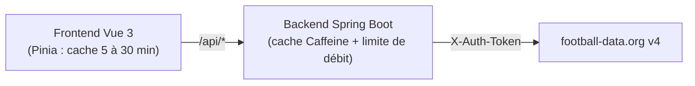

# ⚽ Dashboard Foot

Tableau de bord des grands championnats européens de football : classements, meilleurs buteurs et résultats de la dernière journée, présentés comme un album de vignettes.

[](https://github.com/foucouthibault/Dashboard-foot/actions/workflows/node.js.yml)


[](./LICENSE)

Ce dépôt contient le **frontend** (Vue 3 + TypeScript). Il s'appuie sur un backend Spring Boot, [Dashboard-foot-backend](https://github.com/foucouthibault/Dashboard-foot-backend), qui relaie et met en cache l'API [football-data.org](https://www.football-data.org/).

## Fonctionnalités

- 🏆 Ligue 1, Premier League, La Liga, Bundesliga, Serie A et Coupe du Monde
- 📊 Classement de la saison en cours et des deux saisons précédentes
- 🥇 Meilleurs buteurs par saison
- 🏟️ Résultats de la dernière journée jouée
- ♿ Sélecteur de saison utilisable au clavier (flèches, Début, Fin), interface responsive

## Architecture



Le frontend n'appelle jamais football-data.org directement : il interroge `/api`, que le serveur Vite relaie en développement vers le backend (`localhost:8080`).

### Choix techniques

- **Un backend proxy plutôt qu'un appel direct** : la clé d'API reste côté serveur, et on évite les problèmes de CORS.
- **Un quota tenu côté serveur** : l'offre gratuite de football-data.org limite à 10 requêtes par minute. Le backend applique cette limite à tous les visiteurs réunis (fenêtre glissante) et répond `429` avec `Retry-After` plutôt que de se faire bloquer par l'API.
- **Un cache adapté à chaque type de donnée** : 60 s pour les compétitions et les matchs, 5 min pour la saison en cours, 24 h pour les saisons terminées, qui ne changent plus.
- **Un cache aussi dans le navigateur** : les stores Pinia gardent les réponses par compétition et par saison, pour ne pas refaire de requête à chaque changement d'onglet.
- **Une interface qui résiste aux formats variés de l'API** : les classements `HOME` et `AWAY` sont écartés, et les compétitions à poules (Coupe du Monde) sont mises à plat.

## Démarrage rapide

### Prérequis

- Node.js 22+
- Le [backend](https://github.com/foucouthibault/Dashboard-foot-backend) (Java 25) lancé sur `http://localhost:8080`, avec une clé football-data.org ([inscription gratuite](https://www.football-data.org/client/register))

### Installation

```bash
# 1. Lancer le backend (dans un autre terminal)
git clone https://github.com/foucouthibault/Dashboard-foot-backend.git
cd Dashboard-foot-backend
FOOTBALL_DATA_API_TOKEN=votre_cle ./mvnw spring-boot:run

# 2. Lancer le frontend
git clone https://github.com/foucouthibault/Dashboard-foot.git
cd Dashboard-foot
npm install
npm run dev
```

L'application est disponible sur http://localhost:5173.

Aucune variable d'environnement n'est nécessaire côté frontend en développement. Voir [`.env.example`](./.env.example) pour pointer vers un backend hébergé ailleurs.

## Commandes

| Commande | Description |
|----------|-------------|
| `npm run dev` | Serveur de développement |
| `npm run build` | Vérification des types + build de production |
| `npm run preview` | Sert le build de production en local |
| `npm test` | Tests unitaires (une passe) |
| `npm run test:unit` | Tests unitaires en mode watch |
| `npm run test:e2e` | Tests end-to-end (Playwright) |
| `npm run lint` | ESLint avec correction automatique |
| `npm run format` | Formatage Prettier |

## Tests

- **Unitaires** (Vitest) : logique des stores Pinia (filtrage des classements, cache par saison, gestion des erreurs).
- **End-to-end** (Playwright) : parcours accueil → championnat et affichage des erreurs. L'API est simulée avec `page.route`, donc les tests ne dépendent ni du backend ni du quota.

```bash
npm test
npx playwright install chromium   # première exécution uniquement
npm run test:e2e
```

La CI GitHub Actions lance le lint, les tests unitaires, la vérification des types, le build et les tests E2E à chaque push et chaque pull request.

## Structure du projet

```
src/
├── api/            # Appels HTTP (Axios) : compétitions, classements, matchs, buteurs
├── components/     # Composants d'affichage (classement, buteurs, journée, bannières)
├── composables/    # Logique réutilisable (identité visuelle des ligues)
├── constants/      # Images de remplacement
├── router/         # Routes : accueil, championnat
├── stores/         # Stores Pinia avec cache et tests (__tests__)
├── types/          # Types des réponses de l'API
└── views/          # Pages : accueil, championnat
e2e/                # Tests Playwright
```

## Stack

[Vue 3](https://vuejs.org/) (Composition API) · [TypeScript](https://www.typescriptlang.org/) · [Vite](https://vite.dev/) · [Pinia](https://pinia.vuejs.org/) · [Vue Router](https://router.vuejs.org/) · [Axios](https://axios-http.com/) · [Vitest](https://vitest.dev/) · [Playwright](https://playwright.dev/) · ESLint · Prettier

## Licence

[MIT](./LICENSE)
